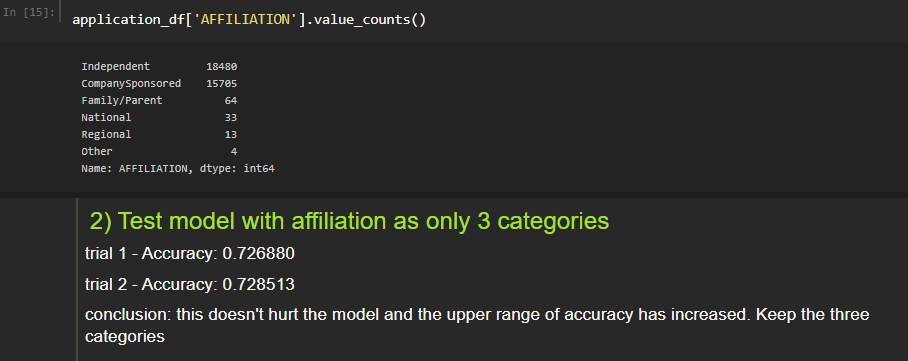
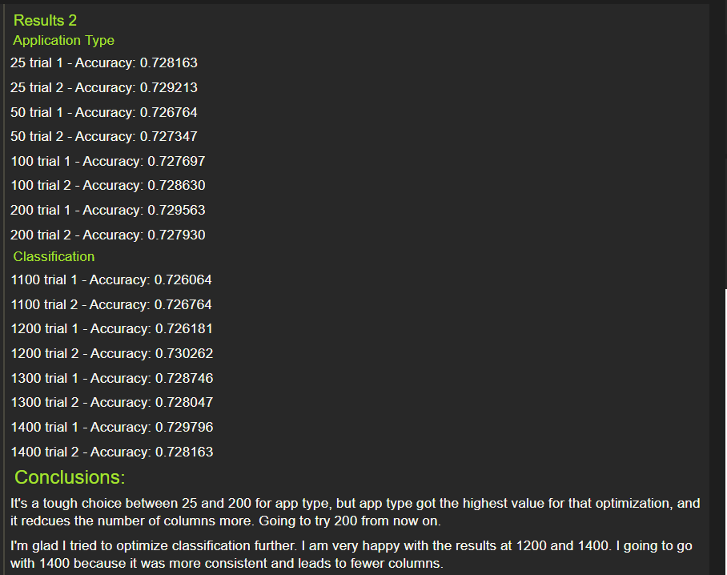
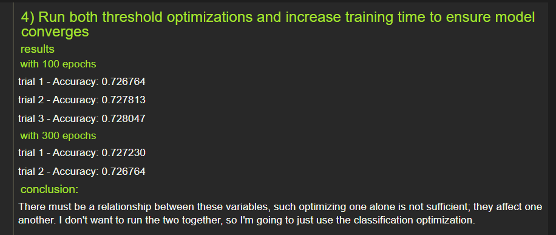
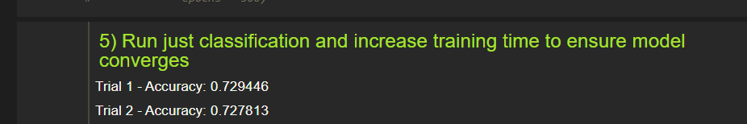
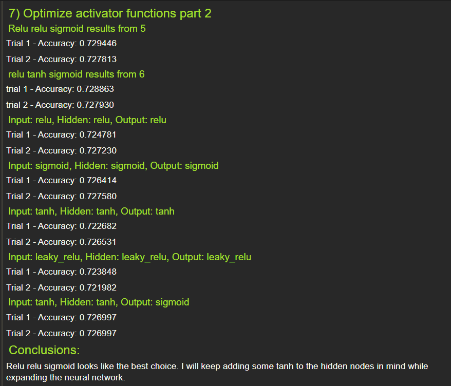
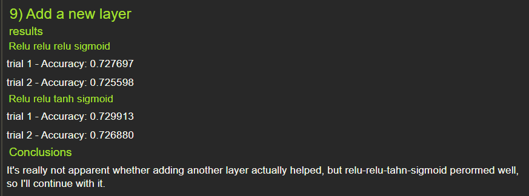
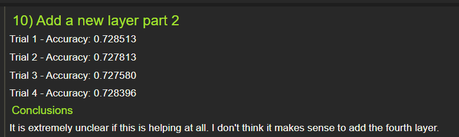
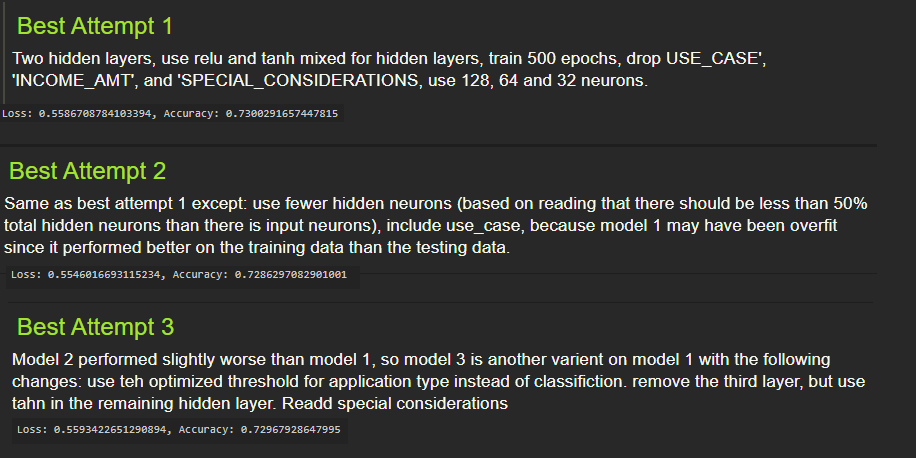

# Neural Network Charity Analysis: using deep learning to decide which applications for charity money should be approved
## Overview
Bek, a data scientist from the nonprofit foundation Alphabet Soup, has been tasked with finding a better way to know which donation applications should be granted.  Many recipients use their funds to do good, but others do not.  Minimizing the number of recipients who do not use the money as intended is a priority for the foundation.  I have been tasked with building a neural network to predict which groups are low risk candidates (likely to use the money as intended). 
## Results
### Data Preprocessing
- The target for the dataset was IS_SUCCESSFUL
- The features included APPLICATION_TYPE, AFFILIATION, CLASSIFICATION, USE_CASE, ORGANIZATION, INCOME_AMT, SPECIAL_CONSIDERATIONS, and ASK_AMT.  
- EIN and NAME are not features (they are identifiers for the grant) and should be removed.  All targets (IS_SUCCESSFUL) are not features.  It was not entirely clear to me whether STATUS was a feature or not, because I was not sure what “active status” meant.  I chose to consider it a non-feature for my optimized models, on the assumption that this might mean whether the application is “active” which should theoretically have nothing to do with whether the charity money was used successfully.
### Compiling, Training, and Evaluating the Model
- Initially, I chose 80 input and one layer of 30 hidden neurons, because that it what the starter code showed in the model summary.  I used relu as the activator function for the input and hidden neurons and sigmoid for the output neurons, because this is what the majority of the module used.  Relu was stated to be a common function used for most problems, and sigmoid was a better choice for the output, which was dichotomous.  I always included a tanh function because my optimization sweeps suggested this helped the model.  When the first two models with 2 hidden layers were performing better in the training stage than the testing stage, I backed down to 1 hidden layer for the final model to see if this would reduce any overfitting.  My final mods used the following:
	- 128 relu, 64 relu, 32 tanh, 1 sigmoid (based on the optimization procedure outlined below)
	- 128 relu, 30 relu, 20 tanh, 1 sigmoid (based on reading advice that there should be less than half as many hidden neurons as input neurons)
	- 128 relu, 64 tanh, 1 sigmoid
- The best model I achieved had an accuracy of 73%, so I did not meet the 75% goal.
- See the next section for a detailed account on optimizing model performance.  I tried to change the following to optimize performance:
  - drop each feature column
  - change the binning of columns
  - change the activator functions
  - change the number of neurons
  - change the number of hidden layers
  - change the optimizer function while compiling.
###  Increasing model performance
Initially, I tried to manually change the model by tweaking parameters based on my understanding of what changes should increase model performance.  This failed entirely ([see manual optimizations](AlphabetSoupCharity_Optimization_Manual_Attempt.ipynb)).  The original model performed with accuracy between about 72.4% - 72.7%, and my manual optimizations were within this range.
My next approach was to employ parameter sweeps.  I first took the preexisting code and converted it into a series of functions.  This allowed me to recreate the data and reset new models by passing parameters to a single master function instead of rerunning many code blocks, thereby automating the process and making it amenable to being done in loops.  I then ran approximate 100 models to optimize the following:
1 - Which columns to drop (looped serially through: `[col for col in cols if col not in ['EIN', 'NAME', 'APPLICATION_TYPE', 'CLASSIFICATION', 'IS_SUCCESSFUL']]`.  I eventually chose to drop 'USE_CASE', 'INCOME_AMT', 'SPECIAL_CONSIDERATIONS', and 'STATUS' for my best model. (The output is rather large.  Please see Sweep section 1 in [the optimization code](AlphabetSoupCharity_Optimization.ipynb)).
2 - The first optimization suggested that affiliation was very important.  Affiliation had a very asymmetric distribution of data, where nearly all the data was in 2 categories and the rest was distributed across several small ones.  I tried binning Affiliation into three categories, and this improved the model’s upper range, so I continued to do this.

3 – I next tested a larger range of thresholds for Application Type and Classification (for both: [100, 250, 500, 1000, 1500, 2000]).  After these initial sweeps I zoned in on more promising thresholds (Application Type = [25, 50, 100, 200]  and Classification = [25, 50, 100, 200]).  For Application Type I chose 200 as the best threshold option, and Classification I chose 1400.

4 – I expected combining these two thresholds to lead to a better mode.  In fact, it led to a worse fit.  I concluded that these two variables must be related somehow, and optimizing for the two separately and trying to combine the individually optimized values was not going to work.  I decided to just use the new 1400 threshold for Classification and stick with the original 500 threshold for Application Type going forward (though for best model 2 I used the original Classification threshold of 1000, and 200 for Application Type).

5 – I tested the 1400 threshold for Classification and 500 threshold for Application Type model with a longer epoch value to ensure that it did give better results than the model in section 4.

6 – I used a permutations function from package itertools to generate all permutations of the five activator functions for a neural network with one hidden layer.  (The output is rather large.  Please see Sweep section 6 in [the optimization code](AlphabetSoupCharity_Optimization.ipynb)).  My final conclusions were the following: Good models were considered to be those that have at least .727 accuracy on both trials.  Sigmoid seems to be the best choice for the output node based on all good models. All good models had a tanh and a relu or leaky_relu layer, where relu models performed better than leaky_relu. Good models also tended to perform better when the input node had relu or leaky relu and the tanh function was on the hidden node.

7 – Because the permutation function created permutations without replacement, I tested four models where all nodes were of one type.  These were not better than the models in section 6.  I also tested a Tanh Tanh Sigmoid model and compared it to my existing data on Relu Relu Sigmoid to check if a model that did not use Relu would perform better.  I found that Relu Relu Sigmoid performed the best, but because the Relu Tanh Sigmoid performed well, I decided to test using Relu Relu Tanh Sigmoid when I started increasing network complexity.

8 – Because increasing the number of neurons in a neural network can change the model fit, I decided to test sets of fewer and more neurons: [ [2, 1], [4, 2], [8, 4], [16, 8], [32, 16], [64, 32], [128, 64], [256, 128] ].  (The output is rather large.  Please see Sweep section 8 in [the optimization code](AlphabetSoupCharity_Optimization.ipynb)).  The model did not perform as well when there were fewer than 16 input neurons, but it was not clear if adding more neurons than that helped.  To be careful, I increased the neuron count to 128 + 64, but I’m not sure this was valuable.

9 – I tested adding a second and then third hidden layer.  I used tried both Relu Relu Tanh Sigmoid and Relu Relu Relu Sigmoid.  The model with Tanh in it performed better than the one without, though it was unclear whether this model was better than Relu Rely Sigmoid.  I chose to retain that layer to be safe.

10 - I tested adding a third hidden layer, but saw no changes to justify the additional complexity.

11 – finally, I tested using a different optimizer functions during model compiling, but the original adam function performed the best.  (The output is rather large.  Please see Sweep section 11 in [the optimization code]( AlphabetSoupCharity_Optimization.ipynb)).  

Best Model 1 is the model I made based on the sweep decisions.  Best Model 2 is a variation on that model, where I used fewer hidden neurons based on some network optimizing advice I read online.  I also readded USE_CASE, because I was concerned the first model was overfit, and thought adding more of the original data back might help.  Best Model 2 was worse than Best model 1, so Best Model 3 is also a variation on Best Model 1.  In this case, I stepped back to just one hidden layer, readded SPECIAL_CONSIDERATIONS instead of USE_CASE, and used the optimized threshold for Application Type (200) with the original threshold for Classification (1000).

## Summary
Overall, it’s a strong model, because it is accurate more than 70% of the time.  However, I am concerned about how it will respond to new data.  It was trained on grants that were awarded to predict which will use the money well.  It’s less clear how well it will perform when if sees grants that would otherwise not have been awarded.  Ideally, this model would be able to be used before a human has to review applications rather than after.  However, as is, the model is expected to enrich the much of grants that are awarded to individuals who will use the money as stated.  I think a random forest model would be an excellent alternative to a neural network in this case.  They handle non-linear data and outliers well, and their structure is more easily interpreted.  One of the challenges in fitting the neural network was that it behaved in unexpected ways, forcing me to use sweeps to blindly feel around the parameter space for better model parameters.  I imagine it would be easier to improve the fit of the model using a random forest.
